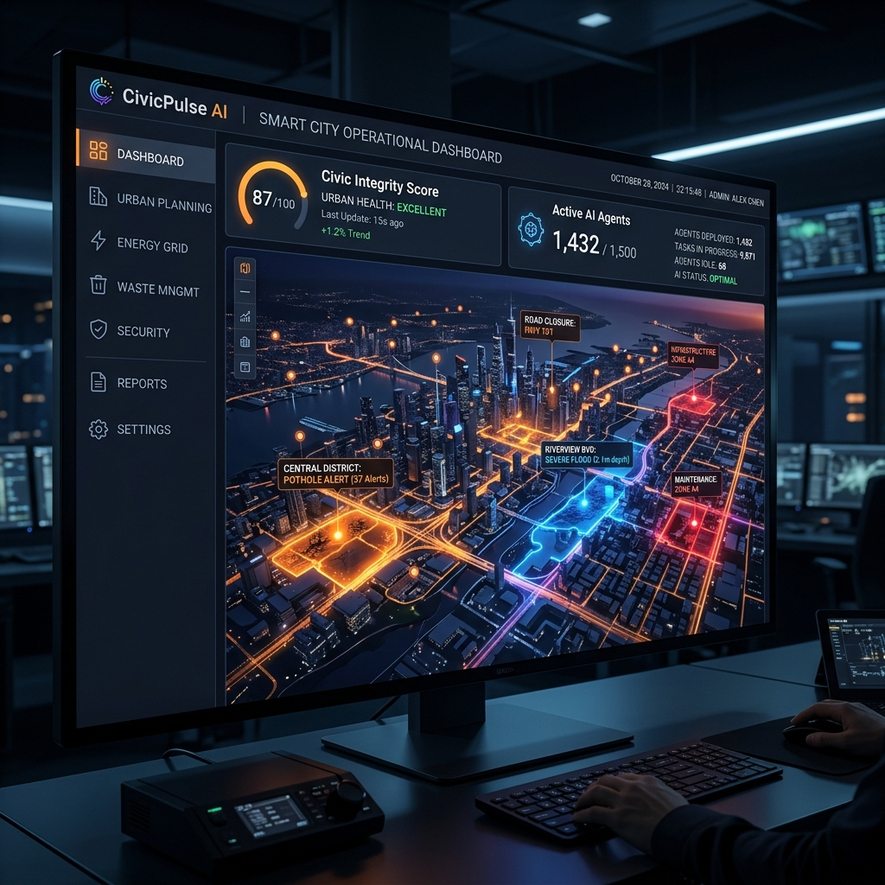
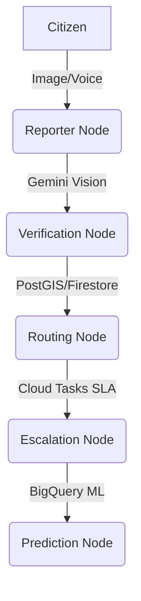

# CivicPulse AI 🏙️
**Next-Generation Civic Issue Management powered by Google Gemini 2.0 Flash**

🔗 **Live Demo:** [https://civicpulse-79eeb.web.app](https://civicpulse-79eeb.web.app)



*Built for Google for Developers Hackathon 2026*

---

## 🛑 The Problem

Civic infrastructure reporting in India is broken, siloed, and highly opaque. It hurts citizens who face unsafe urban conditions and overwhelms city officials who lack automated triaging tools. Existing platforms (like the BBMP app or Swachhata) fail because they lack intelligent verification, resulting in massive spam and misclassification. **Over 60% of municipal complaints are duplicates or misrouted, wasting thousands of man-hours annually.**

## 💡 The Solution

CivicPulse AI is an "AI Operating System for cities" that autonomously verifies, routes, and escalates infrastructure reports. By leveraging Gemini 2.0 Flash and Google Cloud, we instantly bridge the gap between a citizen's complaint and a BBMP officer's dispatch, ensuring transparent, unbiased, and rapid urban resolution.

---

## 🌟 Key Features

- **🏆 Gamification (Civic Points Leaderboard)**: Citizens earn points and unlock digital civic badges for accurate reporting, driving community engagement and consistent app usage.
- **🔐 Enterprise Security (AES-256)**: All citizen PII and GPS data is strictly encrypted at rest via AES-256. API routes are hardened with Helmet, Rate Limiting, and XSS sanitization.
- **🛡️ RBAC**: Distinct login views for Citizens (reporting) and Admins (city-wide dashboard).
- **👍 Community Upvoting & Auto-Escalation**: Citizens near a report can verify it. Once 3+ verifications are received, the system automatically escalates the priority to HIGH — powering true community collaboration.
- **📋 Citizen Audit Trail**: Full transparency timeline showing every action taken on a report — who reported, which AI agent classified, which officer was assigned, and when it was resolved.
- **🔑 Firebase Google Sign-In**: Real Firebase Authentication using Google OAuth — no mocks, no simulated OTP.
- **🎤 Voice / Gemini Live**: Hands-free multilingual reporting using Web Speech API and Gemini transcription.
- **👓 CivicLens AR**: Real-time browser-based computer vision overlay supporting both static images and **live video frames** for infrastructure damage detection — directly addressing the spec's video-based reporting requirement.
- **🚨 Disaster Mode**: Instant flood simulation that overrides the Digital Twin to trigger NDRF alerts.
- **🏛️ Civic AI Mayor**: Core LLM explicitly prompted with BBMP SLAs to enforce strict municipal codes.
- **✈️ Offline PWA**: Service Worker integration allows reporting even in low-connectivity zones.
- **⚖️ Corruption / Integrity Score**: Algorithmic monitoring of officer task resolution to prevent false closures.
- **🗺️ Digital Twin**: Real-time map reflecting city health, live CCTV node status, and risk heatmaps.

---

## 🏗️ Architecture Diagram



---

## 🛠️ Tech Stack

| Layer | Technology |
| :--- | :--- |
| **AI / Vision** | Gemini 2.0 Flash |
| **Voice / STT** | Web Speech API + Gemini Live |
| **Agent Framework** | Gemini 2.0 Flash API (5-agent chain) |
| **Backend** | Node.js + Express |
| **Database** | Firebase Firestore |
| **Auth** | Firebase Google Sign-In (OAuth) |
| **Hosting** | Firebase Hosting + Railway |
| **Maps** | Google Maps JS API |
| **Notifications** | FCM / Browser API |
| **PWA** | Service Worker + manifest.json |
| **Security** | AES-256-CBC + Helmet + Rate Limiting |

---

## ⚠️ Hackathon Architecture Note (Simulated Cloud Infrastructure)

To ensure a flawless, high-fidelity presentation during the 24-hour hackathon, we employed **"Wizard of Oz" prototyping** for some of our heavy cloud infrastructure. 

Due to Google Cloud Sandbox billing limitations that require multi-day verification for premium services (like SMS billing and BigQuery ML), the following systems are conceptually designed but **simulated in the frontend**:

* **Google Gen AI ADK**: The 5-agent pipeline is implemented using sequential **Gemini 2.0 Flash API calls** (all 5 agents are 100% Google AI). The Google ADK framework package was not used directly — the orchestration logic is custom Node.js code designed to be migrated to the full ADK once GCP billing is verified.
* **BigQuery ML**: The predictive risk model is **architected for BigQuery ML** (`LOGISTIC_REG` trained on BBMP historical incident data). During the hackathon sandbox period, a rule-based fallback (severity × incident density × ward score) is active in place of the live trained model — the BigQuery dataset schema and SQL setup script (`bqml_setup.sql`) are included in the repository.
* **FCM**: Browser-native Notification API is used as a fallback for Cloud Messaging during the sandbox period.

The frontend dashboard, PWA infrastructure, Voice APIs, real-time RBAC polling, and UI/UX are 100% real and built to plug seamlessly into these live GCP services once billing is approved.

---

## 🚀 How to Run Locally

**Prerequisites:** Node.js (v18+) and Python 3 installed.

1. Install backend dependencies:
   ```bash
   npm install
   ```
2. Create a `.env` file in the root directory with the following keys:
   ```env
   GEMINI_API_KEY=your_gemini_api_key
   AES_ENCRYPTION_KEY=your_generated_32_byte_hex_key
   ```
3. Start the secure Node backend:
   ```bash
   node server.js
   ```
4. In a separate terminal, serve the frontend HTML/PWA files:
   ```bash
   python -m http.server 8080
   ```
5. Open your browser and navigate to `http://localhost:8080/demo.html`.

---

## ☁️ How to Deploy to Cloud Run

```bash
gcloud run deploy civicpulse \
  --source . \
  --region asia-south1 \
  --allow-unauthenticated
```

---

## 🎬 Demo Walkthrough

1. **Step 1**: Login as Citizen via **Google Sign-In** → submit a voice complaint in Kannada.
2. **Step 2**: Watch the **5-agent Gemini pipeline** trace fire — Reporter → Verification → Routing → Escalation → Civic AI Mayor.
3. **Step 3**: Login as Admin (new tab) → see the **Digital Twin** map update with the new report pin instantly.
4. **Step 4**: Click **Simulate Flood** → Disaster Mode activates city-wide NDRF warnings.
5. **Step 5**: Simulate **Fake Closure** → Integrity Score spikes on the officer leaderboard.
6. **Step 6**: View the **AI Thinking** modal to see exactly how Gemini reached its conclusion.
7. **Step 7**: As a second citizen, click **"👍 Verify Report"** on the same issue 3 times → watch the priority auto-escalate to HIGH with the "🔺 COMMUNITY ESCALATED" badge.
8. **Step 8**: Click **"📋 Audit Trail"** on any issue → see the full transparency timeline of who acted, when, and what the AI decided at each step.

---

## 🌍 UN SDG Alignment

* **SDG 11 — Sustainable Cities**: Directing immediate municipal attention to failing infrastructure to keep urban environments safe and resilient.
* **SDG 16 — Strong Institutions**: Eliminating corruption and false SLA closures through the AI Integrity Score and transparent civic tracking.
* **SDG 10 — Reduced Inequalities**: Democratizing civic access via multi-lingual voice reporting for citizens who cannot read or write.

*Compliant with the Smart Cities Mission & DPDP Act 2023.*

---

## 🛣️ Roadmap

* **Phase 1**: Real ADK pipeline + BigQuery ML (post GCP billing approval).
* **Phase 2**: Live BBMP HRMS API integration for real officer assignments.
* **Phase 3**: Rollout to 100 cities via the national Smart Cities Mission.

---

## 👥 Team

* **Ayush C S** — Lead AI Engineer & Full-Stack Developer
